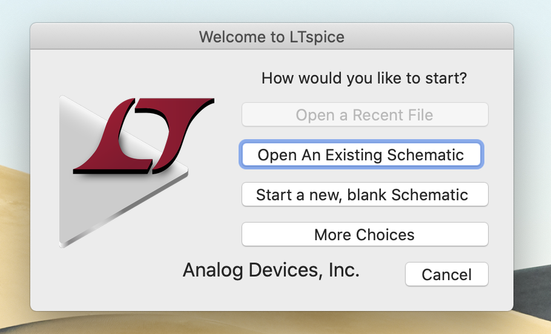
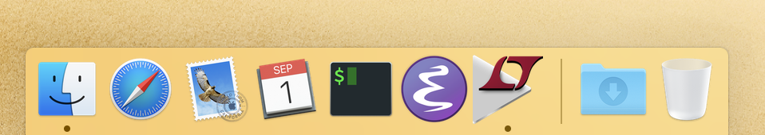

# Better-LTspice-Icon
An improved LTspice icon for OS X

### Preview Images

LT spice launch screen

LT spice in the dock

### How to install
The only file in this repository that is actually required to install the icons is `LT.icns`. Clone or download the repository, and place `LT.icns` in `/Applications/LTspice.app/Contents/Resources`. This can be easily achieved using the terminal or by navigating to the Applications directory in Finder, right clicking the LTspice app, clicking "Show Package Contents", and placing the file in the Resources directory as indicated in the above path.

### What's all this other stuff?
- `icon.iconset` is a directory with all of the images used to create the `LT.icns` file.
- `logo.afdesign` is the original Affinity Designer file used to create the logo.
- `original.png` is a full size png image exported from the design software.

### License
Distributed under the MIT License. See `LICENSE` for details.